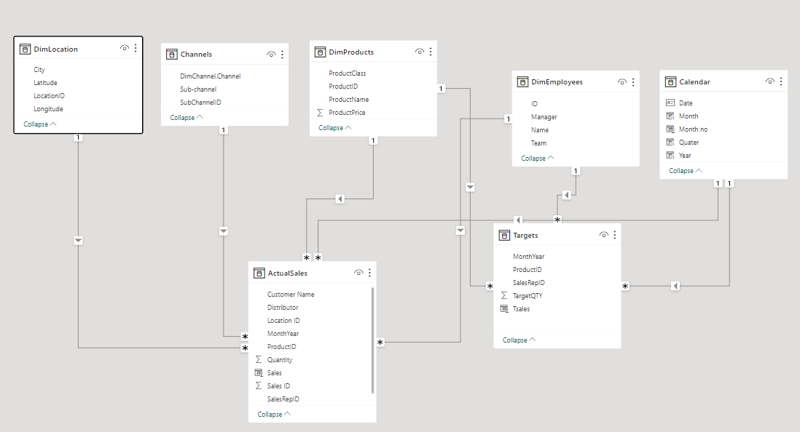
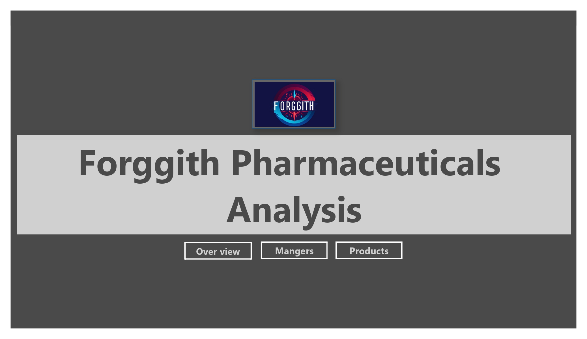
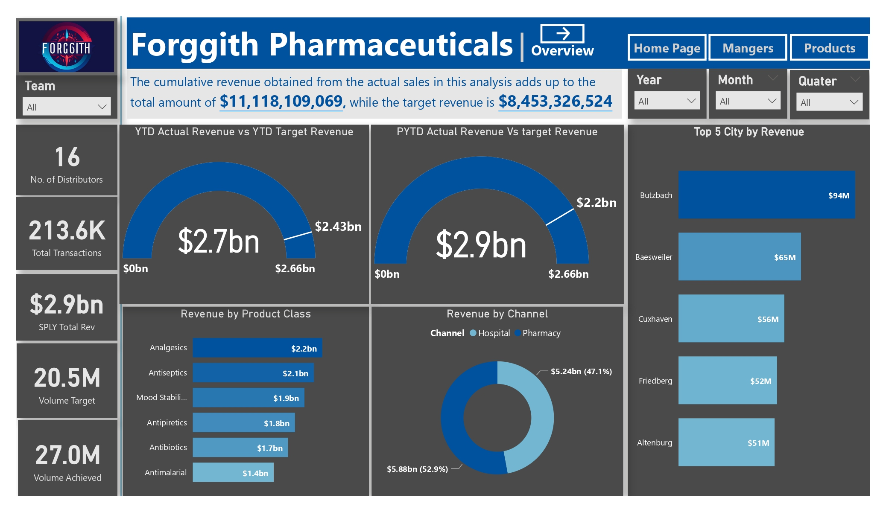
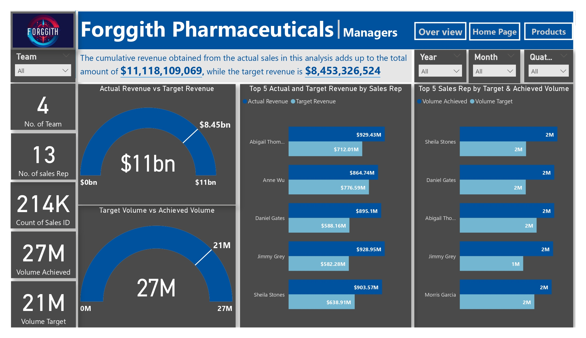
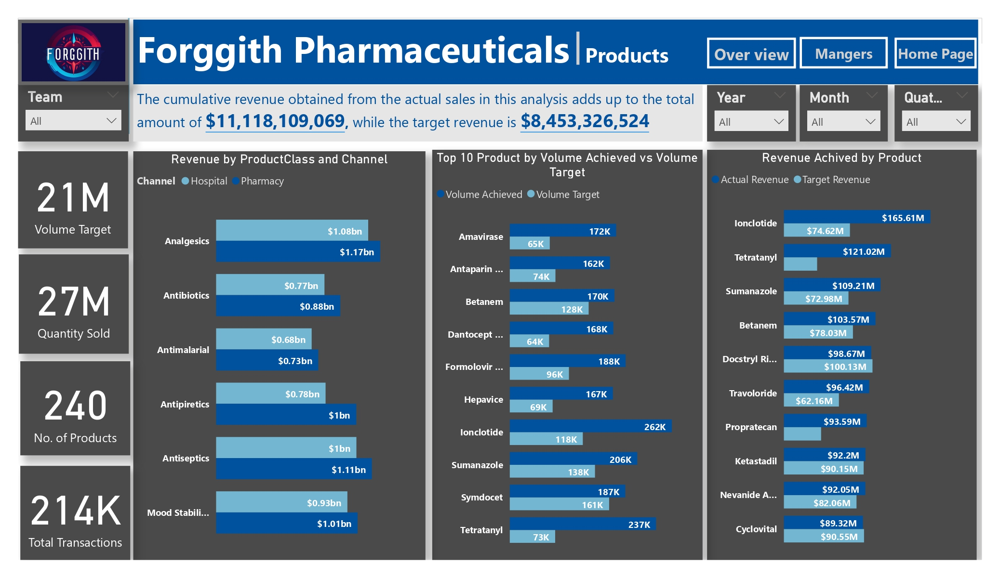

# Forggith Pharmaceauticals Analysis

--- 

## Introduction
This is a Power BI project on analysis of **Forggith Pharmaceutical** is a Pharmaceutical Manufacturing company based in Germany. As a Manufacturing company, they produce medical drugs which get to the consumers through their Distributors. . Forggith provided a template for their distributors to capture records of their sales which are then sent to Forggith on a monthly basis. This data is then used for reporting and analysis by Forggith to achieve their goals Sales and Marketing objectives through tracking and monitoring of KPIs.
In their efforts to maximise growth, Forggith works with a team of Sales and Marketing pros who ensure retailers are able to get their products through the distributors. That is, Forggith does not sell directly to retailers or end-users, they sell to Distributors. But they maintain interaction with retailers, through their Sales and Marketing pros.
This project is from the internship program of Foresight BI, an online learning platform. The program is designed for an opportunity to use Power BI to solve real life Reporting and Analytics problems. Analysis was done on datasets containing the Target and Actual sales record of the company between the years 2022 – 2025.

## Problem Statement 
The project was worked to carry out reports to assist in guiding their strategies, tactics and operations as a company. The reports would help on the following;
1. Help The Sales Representative track their performances through-out the periods to plan their marketing activities.
2. The Team Managers track their teams' performances through-out the periods to plan their teams' activities.
3. Executive team track Revenue numbers to monitor alignment with the set targets to influence medium to long term strategies.

The company expects to see Key Performance Indicators (KPIs) listed below on the report dashboard
- Actual Revenue Performance Previous Year YTD vs Target Previous Year YTD
- Actual Revenue Performance YTD vs Target YTD
- Revenue Month on Month Percentage Change
- Revenue by Location, Channel & Product class
- Revenue Achieved vs Revenue Target
- Volume Achieved vs Volume Target
- Actual Revenue vs Target revenue achievement & Actual volume vs Target volume by Sales Representative
- Actual Revenue Achievement by Sales Team
- Revenue and Volume Achievement by Product.

## Skills Demonstrated
The following Power BI features were incorporated;
- Bookmarking 
- Data analysis Expressions (Dax) 
- Calculated columns 
- Modelling 
- Buttons 
- Tooltips
- Filters 
- Page navigation 
- Data Dictionary: a data dictionary was created by listing out all the columns title and giving them a meaning in the context of the dataset provided, this is to evaluate my understanding of the entire business.
- A mockup of what my report would look like was created

## Data Transformation
Power Query was used for cleaning and transformation of the data set, some of the transformation carried out are as follows;
First of all, four files were provided consisting of PharmDataset and PharmTargets, the other files are the company logo and an excel documents consisting of the company’s standard colours. The Pharmdataset excel workbook has the following tables 
DimLocation, DimSubChannel, DimChannel, DimProducts, DimEmployees, Sales2022, Sales2023-2025
- The append query function was used to append the Sales2022 table and Sales2023-2025 table into a single table that named Actual Sales.
- The merge query function was used to merge DimChannel and DimSubChannel tables with a matching column (ChannelID) into a single table that was renamed Channel
- A calculated column for Revenue in the Actual sales table was created by using the related function to multiply the Quantity column in the actual sales table by the product price column in the Dimproducts table.
- A calendar table was created with auto calendar function with a Date, Year, Quarter, Month and Month No column added to it.

## Data Modelling
Although most of the relationships were created automatically, one of the tables relationship wasn’t because of a difference in the related column name which I did manually

The model used is a star schema model with 6 dimensional tables joined to a fact table in a one-to-many-relationship 

## Visualization
An interactive dashboard that consists of five pages for the metrics and KPIs gathered from this analysis was designed. The report comprises of 5 pages, listed below;
- Home page 
- Overview 
- Overview 2
- Mangers 
- products
You can interact with the project [here](https://app.powerbi.com/links/Ou5iG5ibtw?ctid=f41a0d05-db19-49b3-96a0-33467abb2ffd&pbi_source=linkShare&bookmarkGuid=c4e269a1-4462-45ac-83f4-82ad3fab51e2)

Features:
- Company’s name 
- 3 buttons (overview, managers, products) used to navigate to their respective pages

## Analysis
Overview & Overview 2
Containing key/general metrics for the executive arm of the organization
Overview 
 

### Overview2

### Managers
Containing metrics for the sales team & their managers

### Products
Containing products metrics

 

## Conclusion & Recommendations 
- from the Analysis we can see that the number of distributors reducing yearly with 2025 recording the lowest number of distributors
- Revenue increased yearly with 2024 recording the highest revenue and a surge between 2024 to 2025 that saw revenue decrease by 9.27%
- The company should encourage by rewrading Abigail thompson as she generated the highest revenue
- Koss distributors should be looked at as they are the highest revenue generating distributors 
